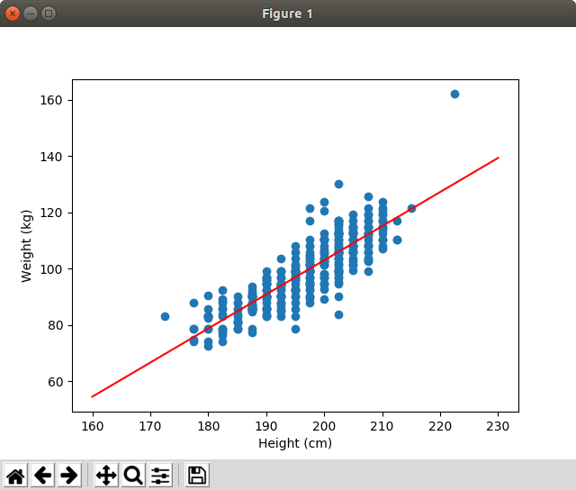
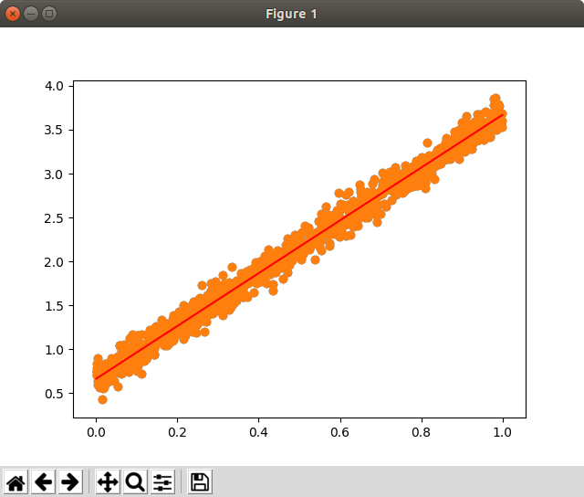
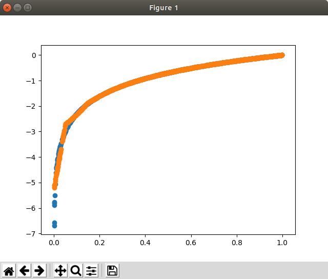
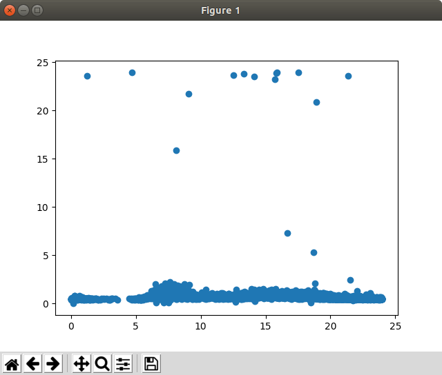
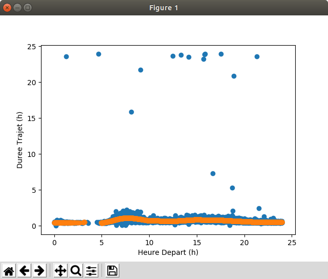

.. image:: https://codeclimate.com/github/liogen/machine_learning/badges/gpa.svg
    :target: https://codeclimate.com/github/liogen/machine_learning
    :alt: Code Climate

Machine learning exercises
==========================

Goals of this repository
------------------------

This repository contains several exercises to practice machine learning algorithm through scikit-learn framework. All exercises come from the Linux magazine HS n°94.

Linear regression
-----------------

In this section, we learned how to use linear regression, define "a" and "b" values to draw the linear equation and how to use spline to represent complex equations.

Dataset
~~~~~~~

Firstly, we had to download several data sets.

* Download "players_stats.csv" => https://www.kaggle.com/drgilermo/nba-players-stats-20142015/
* Download "yellow_tripdata_2017_0*" => http://www.nyc.gov/html/tlc/html/about/trip_record_data.shtml

NBA player size and weight correlation
~~~~~~~~~~~~~~~~~~~~~~~~~~~~~~~~~~~~~~

In this example, we will see a linear correlation between the height of a NBA player and his weight.

.. code-block:: bash

    $ python linear_regression_nba_players_stats_2014_2015.py
    $ python linear_regression_generated_1.py

Spline generated example
~~~~~~~~~~~~~~~~~~~~~~~~

Spline is a way to modelize complex equation that do not follow the pattern ax + b.

.. code-block:: bash

    $ python linear_regression_splines_example.py

Spline usage to modelize traffic jam to JFK airport
~~~~~~~~~~~~~~~~~~~~~~~~~~~~~~~~~~~~~~~~~~~~~~~~~~~

In this exercise, we will use spline to define the different time needed to go to JFK airport followind the same travel in taxi.

.. code-block:: bash

    $ python linear_regression_taxi_nyc.py
    $ python linear_regression_taxi_nyc_splines.py

