.. image:: https://codeclimate.com/github/liogen/machine_learning/badges/gpa.svg
    :target: https://codeclimate.com/github/liogen/machine_learning
    :alt: Code Climate

Machine learning exercises
==========================

Goals of this repository
------------------------

This repository contains several exercises to practice machine learning algorithm through scikit-learn framework. All exercises come from the Linux magazine HS n°94.

Main installation
-----------------

This project use virtualenvwrapper to create a virtual environment for python.

.. code-block:: bash

    $ sudo -H pip install virtualenvwrapper
    $ mkdir ~/.virtualenvs
    $ echo "export WORKON_HOME=~/.virtualenvs" >> ~/.bashrc
    $ echo "source /usr/local/bin/virtualenvwrapper.sh" >> ~/.bashrc
    $ bash
    $ mkvirtualenv machine_learning --python=/usr/bin/python3
    $ workon machine_learning
    $ pip install -r requirements.txt

Linear regression
-----------------

In this section, we learned how to use linear regression, define "a" and "b" values to draw the linear equation and how to use spline to represent complex equations.

Dataset
~~~~~~~

Firstly, we had to download several data sets.

* Download "players_stats.csv" => https://www.kaggle.com/drgilermo/nba-players-stats-20142015/
* Download "yellow_tripdata_2017_0*" => http://www.nyc.gov/html/tlc/html/about/trip_record_data.shtml
* Download "04cars.dat.txt" => https://ww2.amstat.org/publications/jse/datasets/04cars.dat.txt

NBA player size and weight correlation
~~~~~~~~~~~~~~~~~~~~~~~~~~~~~~~~~~~~~~

In this example, we will see a linear correlation between the height of a NBA player and his weight.

.. code-block:: bash

    $ python linear_regression_nba_players_stats_2014_2015.py
    $ python linear_regression_generated_1.py

Spline generated example
~~~~~~~~~~~~~~~~~~~~~~~~

Spline is a way to modelize complex equation that do not follow the pattern ax + b.

.. code-block:: bash

    $ python linear_regression_splines_example.py

Spline usage to modelize traffic jam to JFK airport
~~~~~~~~~~~~~~~~~~~~~~~~~~~~~~~~~~~~~~~~~~~~~~~~~~~

In this exercise, we will use spline to define the different time needed to go to JFK airport followind the same travel in taxi.

.. code-block:: bash

    $ python linear_regression_taxi_nyc.py
    $ python linear_regression_taxi_nyc_splines.py

.. image:: docs/linear_regression_taxi_nyc_splines_1.png
   :width: 200px
   :height: 100px
   :alt: linear_regression_taxi_nyc_splines_1

PCA
---

In this section, we learned how to use PCA, normalized data and reduce variable dimensions.

PCA brute force
~~~~~~~~~~~~~~~

In this exercise, we will use brute force to show all combination of Iris datasets.

.. code-block:: bash

    $ python pca_brute_force.py

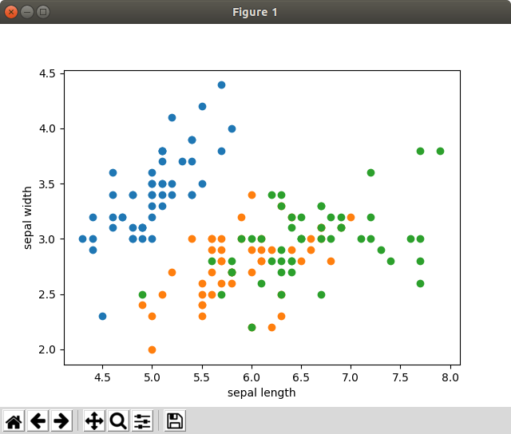

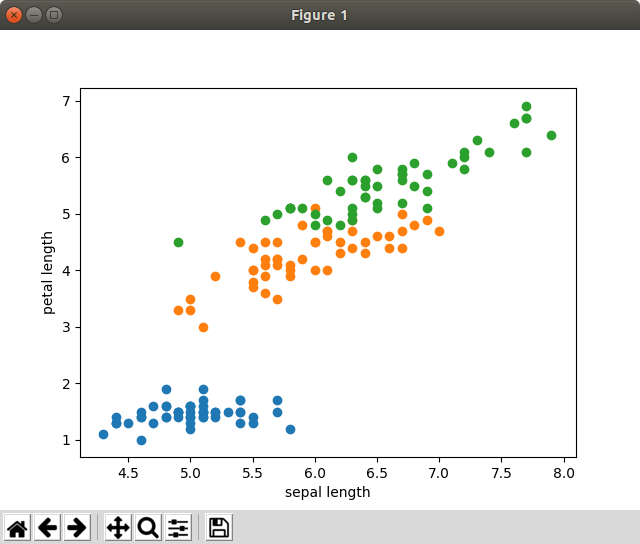

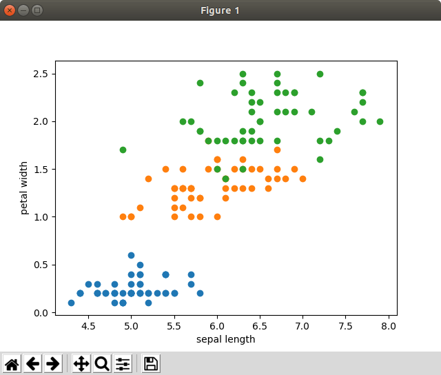

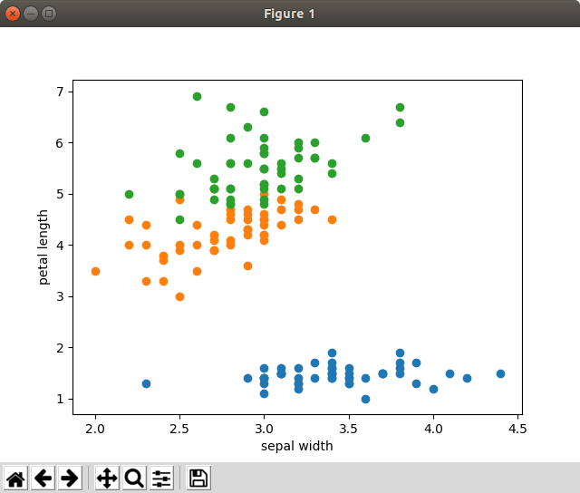

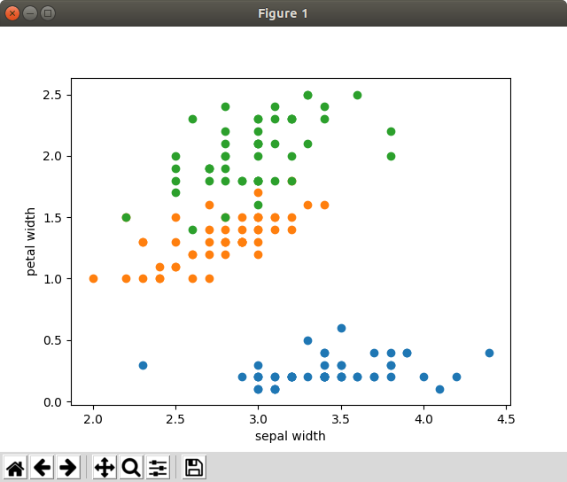

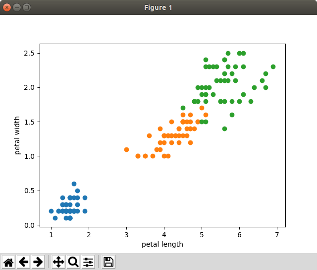

PCA 2D
~~~~~~

In this exercise, we will use a basic linear example to see how to reduce a 2d representation to 1D representation.

.. code-block:: bash

    $ python pca_2d.py

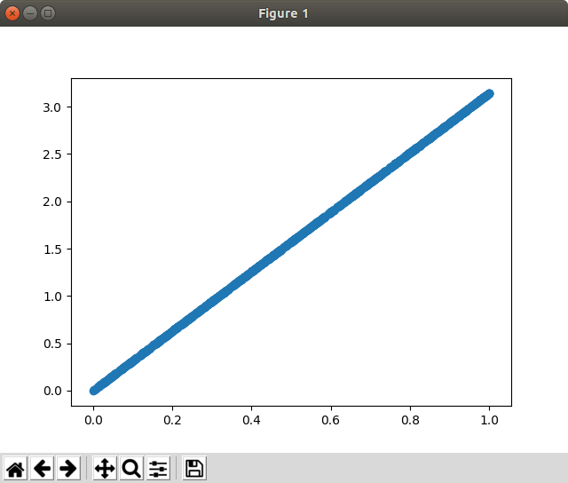

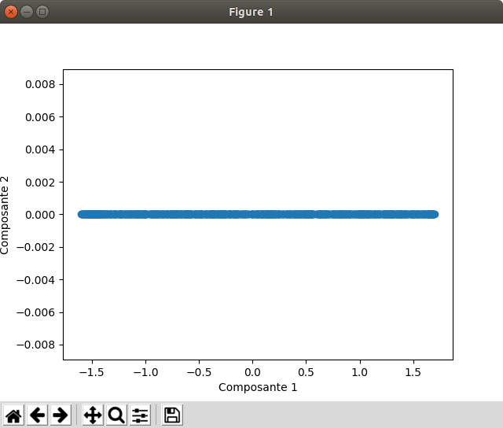

PCA and biplot method on IRIS dataset
~~~~~~~~~~~~~~~~~~~~~~~~~~~~~~~~~~~~~

In this exercise, we will use PCA and biplot methods to represent of one chart the IRIS dataset.

.. code-block:: bash

    $ python pca_biplot_iris.py

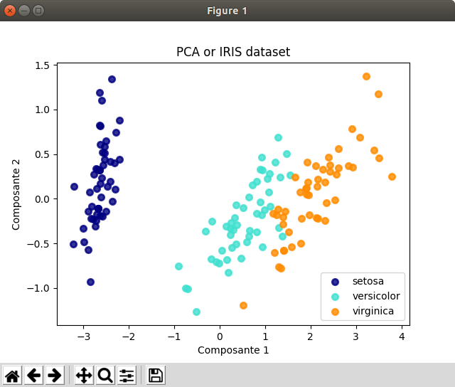

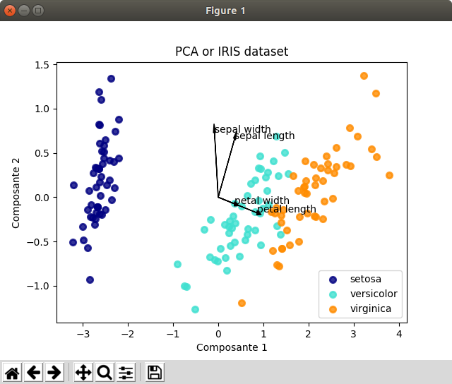

PCA and data normalization
~~~~~~~~~~~~~~~~~~~~~~~~~~

In this exercise, we will see that unnormalized data could alter PCA analysis.

.. code-block:: bash

    $ python pca_normalized.py

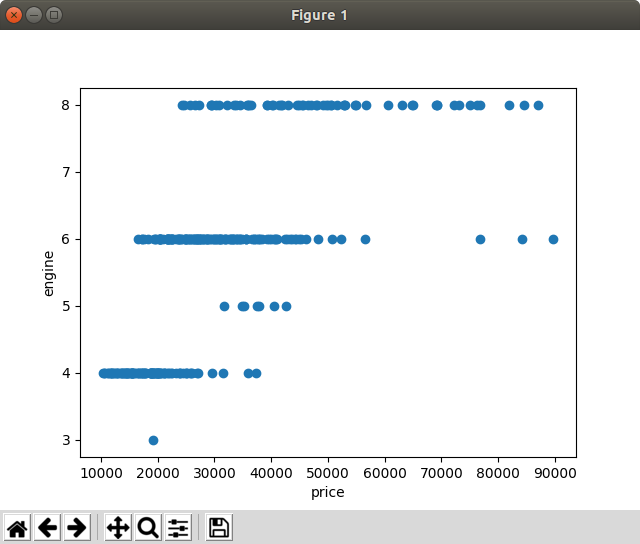

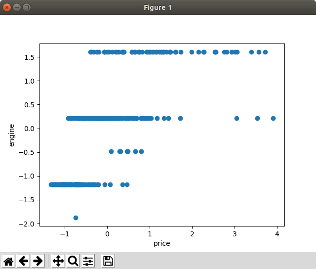

Contribute
----------

This project is distributed under the MIT licence.

To test the quality, run this commands :

.. code-block:: bash

    $ pip install flake8 prospector
    $ flake8
    $ prospector -F -i dataset/

To fix a bug, open an issue in github and submit a pull request.
